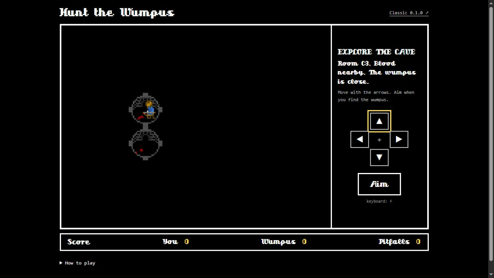

# Hunt the Wumpus

A dark cave, a few very unhelpful bats, and one arrow. What could go wrong?

I made this little game as a learning project, inspired by Hunt the Wumpus on the TI-99/4A. This version brings it to modern Angular and makes room for phones, while keeping the pixel art, the chunky white frames, and the feel of the original.

**[Play Wumpus](https://greta.github.io/wumpus/)** · **[Play Classic 0.1.0](https://greta.github.io/wumpus/classic/0.1.0/)**



## Into the cave

Explore the rooms and look for clues. Blood means the wumpus is close. Slime warns you about a pit. Bats may decide to take you on an unplanned trip.

When you think you know where the wumpus is, take aim and fire into its room. You only get one arrow.

- **Move:** use the on-screen direction pad, arrow keys, or number pad (8, 2, 4, 6)
- **Aim:** tap Aim or press F, then choose a direction to fire
- **Cancel aim:** tap again, press F again, or press Escape
- **After a hunt:** use Retry or Enter for a new cave, or View map / M to see what was hiding in the dark
- **Close the map:** use Close map or Escape

The cave wraps around at its edges, and tunnels bend. Your score stays with you until you refresh or leave the page.

## What's in 0.2.0

- Modern Angular and TypeScript
- The original sprites, font, cave size, and game rules
- A layout that fits phones in portrait or landscape
- Large direction and Aim buttons, always on the game screen
- Keyboard support, visible focus, and text descriptions of nearby clues
- A full cave map after each hunt

The modernization was built with AI assistance. This is a personal learning and portfolio project.

## The original is still here

Version **0.1.0** is preserved in [Classic](classic/0.1.0/), with all 23 original files unchanged. You can still play it from the link above, or get its source from the [v0.1.0 tag](https://github.com/Greta/wumpus/tree/v0.1.0).

Classic keeps its original desktop layout and AngularJS setup, including its external Lodash script. The current game bundles its dependencies locally.

## Run it locally

Use Node.js 24.15 or newer in the 24.x series.

```sh
npm ci
npm start
```

Open `http://localhost:4200/wumpus/`.

```sh
npm test                 # Game rules and input controls
npm run verify:classic   # Check the original archive byte for byte
npm run build            # Production site in dist/wumpus/browser
npm run check            # All of the above
```

The game rules live in `src/app/game.ts`. Angular handles the screen, controls, and responsive map. The original sprite positions are in `src/sprites.css`.

GitHub Actions checks the game and the original archive before publishing to GitHub Pages. See [validation notes](docs/validation.md) for what has been checked.
